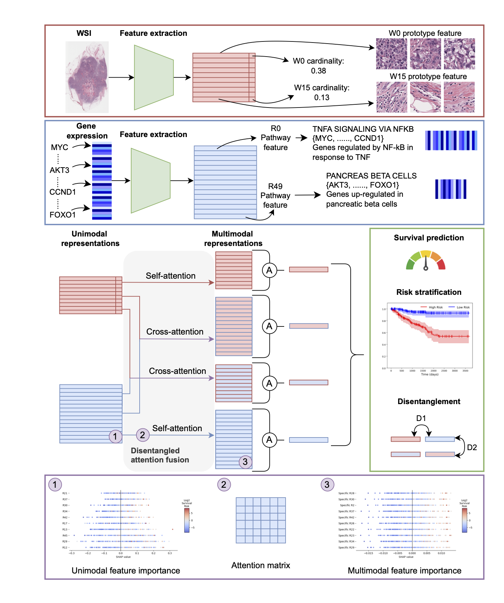

# Bridging the gap between Performance and Interpretability: An Explainable Disentangled Multimodal Framework for Cancer Survival Prediction
While multimodal survival prediction models are increasingly more accurate, their complexity often reduces interpretability, limiting insight into how different data sources influence predictions. To address this, we introduce DIMAFx, an explainable multimodal framework for cancer survival prediction that produces disentangled, interpretable modality-specific and modality-shared representations from histopathology whole-slide images and transcriptomics data. Across multiple cancer cohorts, DIMAFx achieves state-of-the-art performance and improved representation disentanglement. Leveraging its interpretable design and SHapley Additive exPlanations, DIMAFx systematically reveals key multimodal interactions and the biological information encoded in the disentangled representations. In breast cancer survival prediction, the most predictive features contain modality-shared information, including one capturing solid tumor morphology contextualized primarily by late estrogen response, where higher-grade morphology aligned with pathway upregulation and increased risk, consistent with known breast cancer biology. Key modality-specific features capture microenvironmental signals from interacting adipose and stromal morphologies. These results show that multimodal models can overcome the traditional trade-off between performance and explainability, supporting their application in precision medicine.




**Contact:** Aniek Eijpe (a.eijpe@uu.nl)


## Updates
- **02-03-2026:** First version of the codebase is online!

## Model checkpoints
Our model is trained on the outputs of the [UNI](https://github.com/mahmoodlab/UNI) foundation model. Due to [UNI licensing restrictions](https://huggingface.co/MahmoodLab/UNI), we cannot provide the pretrained weights of our model directly.
Instead, we provide detailed instructions to fully reproduce our results. If anything is unclear or if you encounter issues, please don’t hesitate to open an issue or contact us via email at a.eijpe@uu.nl.

## Usage
### Installation
After cloning the repository, create the DIMAFx conda environment as follows:
```
conda env create -f dimafx.yaml
conda activate dimafx
```

### Running DIMAFx
The full workflow consists of the following steps:
- Data preprocessing
- Constructing initial histology prototypes
- Training and testing DIMAFx for survival prediction
- Running SHAP to asses feature importance
- Interpretability analysis of DIMAFx

For detailed instructions on each step, please see the [README](src/README.md) in the `src` folder.


## Acknowledgements
This project builds upon several excellent research repositories, including [DIMAF](https://github.com/Trustworthy-AI-UU-NKI/DIMAF), [MMP](https://github.com/mahmoodlab/MMP), [UNI](https://github.com/mahmoodlab/UNI), [CLAM](https://github.com/mahmoodlab/CLAM) and [CSDisentanglement_Metrics_Library](https://github.com/vios-s/CSDisentanglement_Metrics_Library).
We are grateful to the authors and developers of these projects for their contributions and for sharing their work openly.

## Paper
This is de codebase for our preprint [Bridging the gap between Performance and Interpretability: An Explainable Disentangled Multimodal Framework for Cancer Survival Prediction](https://arxiv.org/pdf/2603.02162). Please consider citing our work if it contributes to your research.


