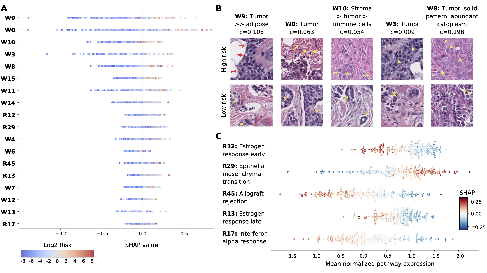
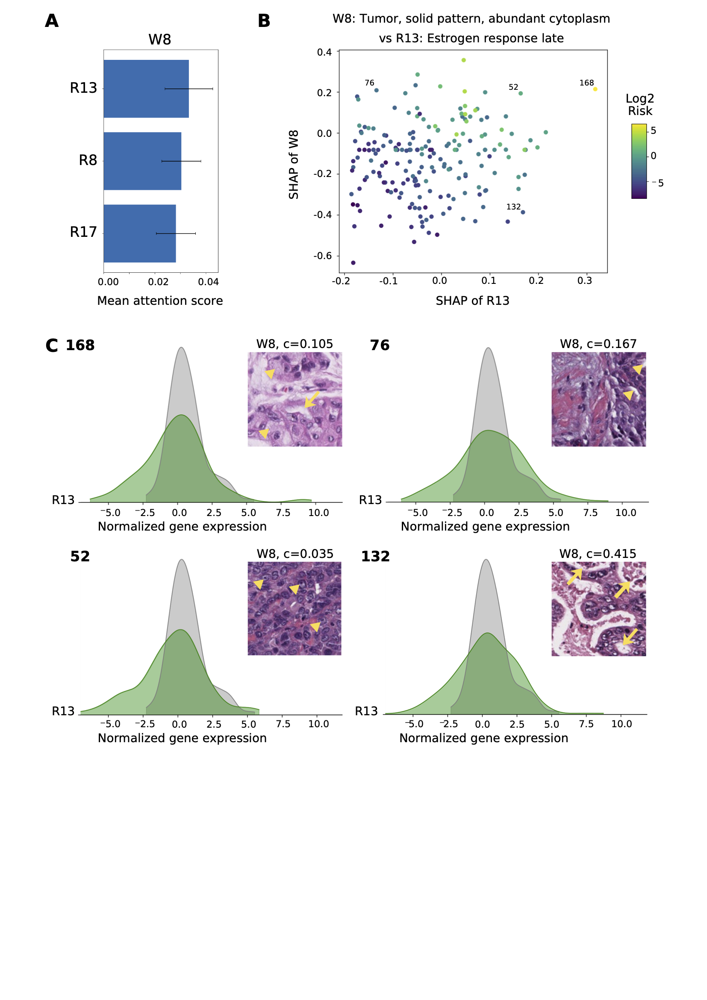

# Interpretability analysis
This folder contains all fles related to the interpretability analyis of DIMAFx. For the complete analysis, follow these steps:

## Feature importance
Before the interpretability analysis, go to the [README](../README.md) in `src` to compute the shap values of all features. Specifically see step 5, which uses `shap_values.py` to compute the shap values using the trained models. 

## Unimodal feature analysis 
This sections explains how to do the unimodal interpretability analysis. Initially, you can you can use `show_shap_unimodal.ipynb` to visualize the unimodal feature importance plots. You can also use this file to show the shap plots of single samples.

### Visualize and annotate WSI features
- `visualize_wsi_feats.py` – Code for visualizing the features of both train and text groups of WSIs for a specific fold:
    - Visualizing the mixture weight distribution
    - Visualizing the prototypes by using the closest patches, with max one patch per prototype per WSI 
    - This code will create the figures described above in a `wsi_representations_vis/` folder within the current dir. You can use these to annotate the WSI features.
- `visualize_wsi_feats.ipynb` – Notebook for visualizing the features of one WSI:
    - Visualizing the mixture proportion distribution
    - Visualizing the prototypes by using the closest patches 
    - Visualize the WSI

### Visualize Transcriptomics features
- `visualize_transcriptomics_feats.ipynb` – Notebook for visualizing the transcriptomics features:
    - Visualization of multiple transcriptomic pathway features, illustrating how the model-assigned feature risk (SHAP values) varies with the mean log-transformed RSEM-normalized pathway expression.
    - Visualizing a pathway feature of one case vs the train cases by showing a ridge plot.

### Example analysis

## Multimodal feature analysis 
This sections explains how to do the multimodal interpretability analysis. 

- `show_shap_multimodal.ipynb` - Notebook to visualize the multimodal feature importance plots. You can also use this file to show the shap plots of single samples.
- `visualize_interactions.ipynb` - Notebook to visualize the intra- and inter-modal interactions. 

### Example analysis

