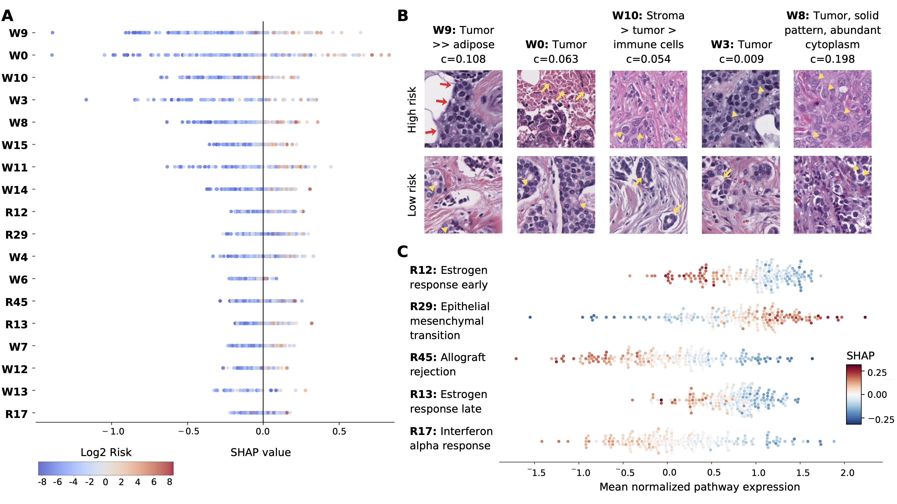
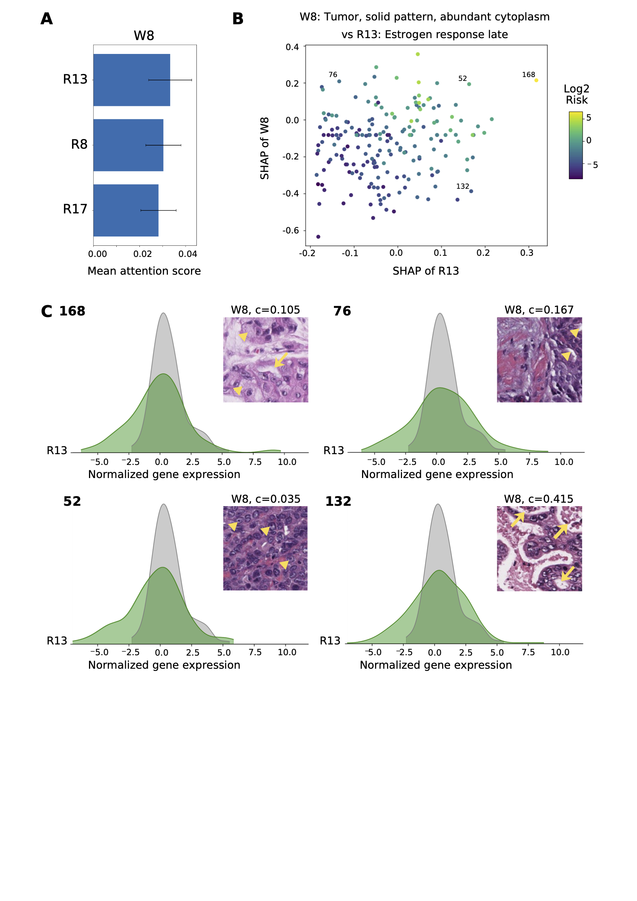

# Interpretability analysis
This folder contains all fles related to the interpretability analyis of DIMAFx. For the complete analysis, follow these steps:

## Feature importance
Before the interpretability analysis, go to the [README](../README.md) in `src` to compute the shap values of all features. Specifically see step 5, which uses `shap_values.py` to compute the shap values using the trained models. 

## SHAP stability across bootstrapped test sets

`compute_shap_stability.py` quantifies how robust the top-ranked SHAP features are to the choice of test samples (Table F.1 in the paper). Here, `--experiment` refers to the name of the experiment, e.g., DIMAFx or DIMAF.
```
python compute_shap_stability.py --experiment DIMAFx --data_type brca --bootstrap_samples 100 --shap_refdist_n 512
```

For each fold and each *k* ∈ {5, 10, 20, 30}:

1. the test set is resampled with replacement `--bootstrap_samples` times (100 by default);
2. for each resample, features are ranked by mean absolute SHAP value and the top *k* are kept;
3. the Jaccard similarity is computed between all pairs of these top-*k* sets.

The reported value is the mean ± standard deviation over all pairs. Values close to 1 indicate that the same features are selected regardless of which test samples are drawn.

Stability is computed for both the unimodal features (`modal`) and the multimodal features after fusion (`post_attn`), and saved per fold.

The notebook `shap_stability.ipynb` aggregates the per-fold results into the table reported in the paper. The `Avg.` column reports the mean and standard deviation across the five fold means.

## Unimodal feature analysis 
This sections explains how to do the unimodal interpretability analysis. Initially, you can you can use `show_shap_unimodal.ipynb` to visualize the unimodal feature importance plots. You can also use this file to show the shap plots of single samples.

### Visualize and annotate WSI features
- `visualize_wsi_feats.py` – Code for visualizing the features of both train and text groups of WSIs for a specific fold:
    - Visualizing the mixture weight distribution
    - Visualizing the prototypes by using the closest patches, with max one patch per prototype per WSI 
    - This code will create the figures described above in a `wsi_representations_vis/` folder within the current dir. You can use these to annotate the WSI features.
    - `--threshold` argument defines the minimum likelihood the patch has to have to represent the specific prototype. This depends on your number of prototypes and the dataset, so have a look at your distribution to find the most optimal threshold. For DIMAFx on BRCA, use the default 0.9
    - Change `--data_type`, `--nr_prototypes` `--fold` accordingly.
- `visualize_wsi_feats.ipynb` – Notebook for visualizing the features of one WSI:
    - Visualizing the mixture proportion distribution
    - Visualizing the prototypes by using the closest patches 
    - Visualize the WSI
- `high_low_risk_wsi_feats.ipynb` - Code used to visualize the WSI features in the paper. 
    - Visualizing specific WSI features of specific samples.
    - Visualizing specific WSI features to show variability within protoypes. This shows high, low and intermediate risk features for a specific WSI feature.
    - Change `--exp`, `--shap_refdist_n`, `--data_type`, `--nr_pt` `--fold` accordingly.


### Visualize Transcriptomics features
- `visualize_transcriptomics_feats.ipynb` – Notebook for visualizing the transcriptomics features:
    - Visualization of multiple transcriptomic pathway features, illustrating how the model-assigned feature risk (SHAP values) varies with the mean log-transformed RSEM-normalized pathway expression.
    - Visualizing a pathway feature of one case vs the train cases by showing a ridge plot.

### Example analysis



## Multimodal feature analysis 
This sections explains how to do the multimodal interpretability analysis. 

- `show_shap_multimodal.ipynb` - Notebook to visualize the multimodal feature importance plots. You can also use this file to show the shap plots of single samples.
- `visualize_interactions.ipynb` - Notebook to visualize the intra- and inter-modal interactions. 

### Example analysis



